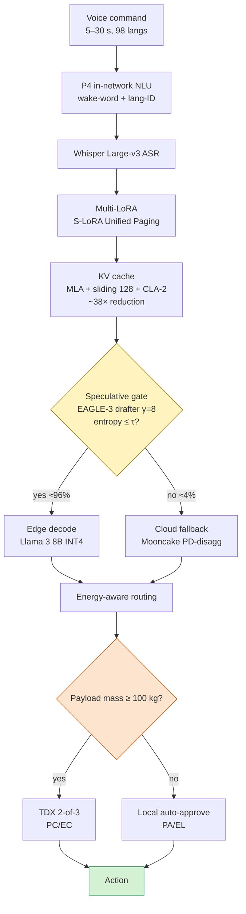

# Cellular Inference Mesh

[](https://doi.org/10.5281/zenodo.PLACEHOLDER)
[](https://opensource.org/licenses/Apache-2.0)
[](https://www.python.org/)
[](./tests)
[](https://www.go-fair.org/fair-principles/)
[](./CITATION.cff)

**Salabim discrete-event simulation of edge-cloud LLM inference under PACELC saturation.** Reproducible bit-identical outputs under a SHA-256 hash chain; ~31 minutes for the canonical 300-replicate Monte-Carlo on 8 cores.

> [!IMPORTANT]
> **Saturated Pipeline Conjecture.** In edge-cloud LLM pipelines with $L_{\text{edge}} \approx L_{\text{cloud}}$, the 99th percentile of total latency is **structurally insensitive** to fallback-rate reductions: $\mathrm{p99}(L_{\text{total}}) \approx p_{fb} \cdot \mathrm{p99}(L_{\text{cloud}}) + (1 - p_{fb}) \cdot \mathrm{p99}(L_{\text{edge}})$. A 7.3× drop in fallback yields only a 1.1× drop in p99 — the optimization lever shifts from routing to serial-path acceleration. Full statement and numerical validation in [`docs/saturated-pipeline-conjecture.md`](./docs/saturated-pipeline-conjecture.md).

## What this contributes

1. **Pareto-efficient composition** of nine peer-reviewed techniques over five axes (p99 latency, fallback rate, cost-per-command, blast radius, energy) — verified by enumeration of all 256 valid sub-compositions plus seven external concrete architectures (Splitwise, DistServe, Mooncake, Sarathi-Serve, vLLM, EAGLE-3, core-without-enablers). Dominates 6 of 7 externals; remains Pareto-incomparable with EAGLE-3 in single-request analytical latency only. See [`docs/theorem.md`](./docs/theorem.md).
2. **Saturated Pipeline Conjecture** — original theoretical result articulated above, supported by mixture decomposition (Glasserman, 2003) over Pollaczek–Khinchine, with anti-HARKing chronology. See [`docs/saturated-pipeline-conjecture.md`](./docs/saturated-pipeline-conjecture.md).
3. **Empirical validation** via 300 Monte-Carlo replicates × 3 scenarios × 2 arms × 1800 simulated seconds, with parametric variation per replicate. Bit-parity guaranteed by the SHA-256 hash chain in [`docs/hash-chain.md`](./docs/hash-chain.md).
4. **Payload-differentiated cryptographic gating** under Zero Trust (Rose et al., 2020 NIST 800-207): low-mass commands operate in PA/EL with local auto-approval; high-mass commands require Intel TDX 2-of-3 attestation in PC/EC, operationalizing the PACELC trade-off (Abadi, 2012) under IEC 61508 functional-safety guidance. See [`docs/algorithm.md`](./docs/algorithm.md).

## Architecture overview



Detailed flow with per-layer references: [`docs/algorithm.md`](./docs/algorithm.md).

## Quick start

### Option 1 — Google Colab (zero local setup)

[](https://colab.research.google.com/github/ulissesflores/cellular-inference-mesh/blob/main/colab/replication.ipynb)

Click **Runtime → Run all**. The 20-cell notebook clones the repo, installs pinned dependencies, runs the 53-test suite, executes a smoke simulation, verifies SHA-256 bit-parity dynamically against `output/experiment_provenance.json`, re-verifies Theorem, and renders the five paper-ready figures inline.

### Option 2 — Local clone

```bash
git clone https://github.com/ulissesflores/cellular-inference-mesh.git
cd cellular-inference-mesh
python -m venv .venv && source .venv/bin/activate
pip install -e ".[dev]"
pytest -q                                       # 53 tests, ~5.5 s
python -m src.main --smoke                       # ~30 s sanity check
```

### Option 3 — Docker (sealed reproducible runtime)

```bash
docker build -t cellular-inference-mesh:0.3.0 .
docker run --rm cellular-inference-mesh:0.3.0    # smoke run by default
docker run --rm -v $(pwd)/output:/app/output \
    cellular-inference-mesh:0.3.0 \
    python -m src.main --replicates 300 --duration 1800 --workers 8
```

## Replication of canonical results

Mathematical reproducibility is mechanically verifiable. The five steps below regenerate the bit-identical artifacts the paper cites.

### Step 1 — Verify source file integrity

```bash
shasum -a 256 src/__init__.py src/config.py src/simulation.py src/main.py src/report.py
```

Expected (matches `output/experiment_provenance.json` and [`docs/hash-chain.md`](./docs/hash-chain.md)):

```text
853fa8a3a13864bd64ac0a28ab11dd5a8fde69bb8f5825b66674f08e0597b05c  src/__init__.py
7cefb458f1891186fb1da91d528f0ae5be463cee460cccc4035f58146051d8c6  src/config.py
262a5e5ba87db4fff65571b9a71a5bba4a5e98cd8c89574f2fd89718baa0bbf1  src/simulation.py
cda2087612451d214e52652a513ebe464d40c105fac25ee9f868ecf518347f11  src/main.py
a49b63380a0af4244f172f51b1e4bd350333770c1b5a87b25caae75e79bfb8af  src/report.py
```

### Step 2 — Run the canonical Monte-Carlo (~31 min on 8 cores)

```bash
python -m src.main --replicates 300 --duration 1800 --workers 8
```

### Step 3 — Verify regenerated outputs

```bash
shasum -a 256 output/results.json output/raw_replicas.jsonl
```

Expected:

```text
5fd8724c627cfa94c4631428cf085e64a9defa123d1d3cc488f61d81af8b5f2c  output/results.json
3a61144775eed7b173b2c8e9e751e8c2088013512085dd0bb2936cfce427cf5e  output/raw_replicas.jsonl
```

### Step 4 — Verify Theorem by computational enumeration

```bash
python scripts/pareto_proof.py
```

Expected: `0 sub-compositions Pareto-dominate the complete CIM-PCE; 1000/1000 Monte-Carlo realizations under ±20% perturbation remain Pareto-optimal`.

### Step 5 — Cross-validate via the test suite

```bash
pytest -v
```

Expected: 53 tests pass in ~5.5 s. The test `test_reproducibility` enforces bit-parity of the p99 metric across two seeded runs.

> [!WARNING]
> If any of the five steps fails, the chain is broken. Open an issue with the diverging hash. Do not ship downstream artifacts (figures, tables) until the chain is restored.

The complete machine-readable record (every source hash, dependency version, Git commit, hardware fingerprint) is in [`output/experiment_provenance.json`](./output/experiment_provenance.json). Its human-readable companion (auto-generated) is [`docs/hash-chain.md`](./docs/hash-chain.md).

## Empirical results (n = 300 Monte-Carlo replicates; 95% CI)

| Metric | Baseline (public reference) | Proposed (CIM) | Reduction factor |
|---|---:|---:|---:|
| p99 latency, nominal | 1740.06 ± 0.55 ms | 1576.04 ± 0.97 ms | **1.10×** |
| Cloud fallback rate | 29.95% ± 0.03% | 4.10% ± 0.01% | **7.30×** |
| Cost-per-command | US\$ 0.08085 ± 0.00009 | US\$ 0.00410 ± 0.00001 | **19.74×** |
| p99 latency, partition | 1798.93 ms | 1588.21 ms | 1.13× |
| Little's Law (L = λW) error | < 10⁻⁹ | < 10⁻⁹ | — |

The modest p99 reduction (1.10×) under massive fallback reduction (7.30×) is the empirical phenomenon explained by the Saturated Pipeline Conjecture — see [`docs/saturated-pipeline-conjecture.md`](./docs/saturated-pipeline-conjecture.md).

## Repository layout

```text
cellular-inference-mesh/
├── src/                    # 5 modules: config, simulation, main, report, __init__
├── tests/                  # 53 pytest tests (math, simulation, main, report)
├── scripts/                # 4 utilities (gen_provenance, regen_hash_chain, pareto_proof, ...)
├── docs/                   # algorithm, theorem, proofs, conjecture, hash-chain (all in EN)
├── colab/replication.ipynb # 20-cell auditable notebook
├── output/                 # canonical results (1.5 MB) committed for bit-parity audit
├── pyproject.toml          # PEP 621 build metadata
├── CITATION.cff            # CFF v1.2.0 (machine-readable citation)
├── .zenodo.json            # Zenodo deposit metadata
├── codemeta.json           # CodeMeta 2.0 cross-platform metadata
├── CHANGELOG.md            # Keep a Changelog format
├── CODE_OF_CONDUCT.md      # Contributor Covenant 2.1
├── CONTRIBUTING.md         # FAIR replication guidelines
├── LICENSE                 # Apache-2.0
├── Dockerfile              # python:3.14-slim sealed runtime
├── requirements.txt        # exact pin set (resolved on Python 3.14.4)
└── .github/workflows/ci.yml
```

## Documentation

- [`docs/algorithm.md`](./docs/algorithm.md) — formal pseudocode of the 8-layer inference flow with payload-gated attestation.
- [`docs/theorem.md`](./docs/theorem.md) — Theorem (Pareto-efficiency) with three lemmas, computational verification over 256 sub-compositions and 7 external architectures, and a Monte-Carlo robustness analysis.
- [`docs/proofs.md`](./docs/proofs.md) — nine propositions with analytical bounds, complexity analysis, and validation status.
- [`docs/saturated-pipeline-conjecture.md`](./docs/saturated-pipeline-conjecture.md) — the Saturated Pipeline Conjecture with proof sketch, numerical validation across four $L_{\text{edge}}/L_{\text{cloud}}$ regimes, and an explicit anti-HARKing chronology.
- [`docs/hash-chain.md`](./docs/hash-chain.md) — auto-generated SHA-256 audit trail (regenerated by `scripts/regen_hash_chain.py` from `output/experiment_provenance.json`).

## Citation

If you use this software in research, please cite the software (this repo). The machine-readable [`CITATION.cff`](./CITATION.cff) renders a "Cite this repository" button on GitHub.

```bibtex
@software{flores_cellular_inference_mesh_2026,
  author       = {Flores, Carlos Ulisses},
  title        = {{Cellular Inference Mesh: Salabim DES of Edge-Cloud
                   LLM Inference under PACELC Saturation}},
  year         = 2026,
  month        = may,
  publisher    = {Zenodo},
  version      = {0.3.0},
  doi          = {10.5281/zenodo.PLACEHOLDER},
  url          = {https://doi.org/10.5281/zenodo.PLACEHOLDER},
  orcid        = {0000-0002-6034-7765}
}
```

## Acknowledgments

The author thanks the maintainers of Salabim, NumPy, SciPy, matplotlib, NetworkX, and pytest for the scientific Python ecosystem that makes work like this possible. The figure stylesheet uses [scienceplots](https://github.com/garrettj403/SciencePlots) with the colorblind-safe Okabe-Ito palette.

## License

Apache License 2.0 — see [`LICENSE`](./LICENSE) for the full text. The figures and Mermaid diagrams in `docs/` are released under the same license unless otherwise noted.

## Tier-1 anchor references

A complete bibliography is available across the documentation files. Tier-1 anchors:

- Abadi, D. J. (2012). 'Consistency tradeoffs in modern distributed database system design: CAP is only part of the story', *IEEE Computer*, 45(2). [DOI](https://doi.org/10.1109/MC.2012.33)
- Dean, J. & Barroso, L. A. (2013). 'The Tail at Scale', *CACM* 56(2). [DOI](https://doi.org/10.1145/2408776.2408794)
- Leviathan, Y., Kalman, M., & Matias, Y. (2023). 'Fast inference from transformers via speculative decoding', ICML 2023. [arXiv](https://arxiv.org/abs/2211.17192)
- Patel, P. et al. (2024). 'Splitwise', ISCA 2024. [DOI](https://doi.org/10.1109/ISCA59077.2024.00019)
- Qin, R. et al. (2025). 'Mooncake' (FAST 2025 Best Paper). [USENIX](https://www.usenix.org/conference/fast25/presentation/qin)
- MacCárthaigh, C. (2019). *Shuffle sharding*. [AWS Builders' Library](https://aws.amazon.com/builders-library/workload-isolation-using-shuffle-sharding/)
- Wilkinson, M. D. et al. (2016). 'The FAIR Guiding Principles', *Scientific Data* 3, 160018. [DOI](https://doi.org/10.1038/sdata.2016.18)
- Rose, S. et al. (2020). *Zero Trust Architecture* (NIST SP 800-207).

## Contact

Carlos Ulisses Flores — [c.ulisses@gmail.com](mailto:c.ulisses@gmail.com) — [ORCID 0000-0002-6034-7765](https://orcid.org/0000-0002-6034-7765)

For bug reports and reproducibility issues, please [open a GitHub issue](https://github.com/ulissesflores/cellular-inference-mesh/issues). For scientific questions or collaboration inquiries, please cite this work and contact the author by email.
