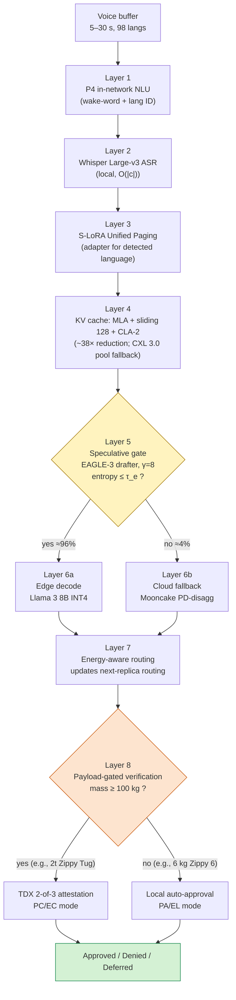
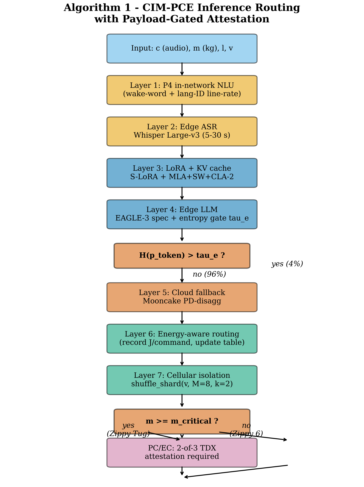

# CIM-PCE Inference Routing Algorithm

> [!IMPORTANT]
> Formal description of the inference flow integrated by the architecture. The eight-layer pipeline composes payload-gated attestation, in-network NLU offload, multi-LoRA federation, multiplicative key-value cache reduction, cross-WAN speculative decoding, prefill-decode disaggregation, cellular isolation, and energy-aware routing. Quantitative gains per technique are bounded analytically in [`proofs.md`](./proofs.md) and verified computationally in [`theorem.md`](./theorem.md).

## 1. Inputs and outputs

The CIM-PCE inference flow receives five inputs:

| Input | Type | Range / default | Description |
|---|---|---|---|
| Audio buffer | bytes | 5–30 seconds, 98 supported languages | Voice command from an AGV operator |
| Payload mass | float (kg) | 0–2000 kg | Carrying mass of the AGV currently executing the command |
| AGV identifier | int | fleet-scoped | Vehicle ID for cellular routing |
| Entropy threshold $\tau_e$ | float (nats) | default 0.85 | Trigger for cloud fallback |
| Critical-mass threshold | float (kg) | default 100 | Distinguishes low-criticality payloads from those requiring reinforced attestation |

The output is a token sequence (the response) plus a binary operational decision: `approved`, `denied`, or `deferred`.

## 2. Eight-layer flow

The flow operates in eight sequential layers, grouped into three functional regions: pre-LLM, edge inference, and cloud fallback (with a post-inference operational region that runs after either edge or cloud completion).

### Pre-LLM region

- **Layer 1 — P4 in-network offload.** Wake-word detection followed by language identification via hash lookup in a P4 match-action table (Gao et al., 2024). Sub-microsecond per stage; no payload reaches the edge LLM unless triggered.
- **Layer 2 — Whisper Large-v3 ASR.** Local audio-to-text in linear time on the input buffer; supports 98 languages.

### Edge inference region

- **Layer 3 — Multi-LoRA federation.** Loads the LoRA adapter matching the detected language with amortized cost via S-LoRA Unified Paging (Sheng et al., 2024).
- **Layer 4 — KV-cache allocation.** Composition of Multi-Head Latent Attention with a 128-token sliding window and Cross-Layer Attention (CLA-2) yields a combinatorial reduction of ~38× over MHA (Proposition 1 in [`proofs.md`](./proofs.md)). On a local miss, the search is extended to the CXL 3.0 pool shared between AGVs in the same cell (Proposition 8).
- **Layer 5 — Speculative decoding gate.** EAGLE-3 drafter proposes $\gamma = 8$ tokens; the target model (Llama 3 8B INT4) verifies them via the modified rejection sampling of Leviathan, Kalman & Matias (2023). If the output-distribution entropy exceeds $\tau_e$, the request is redirected to the cloud fallback. This event is expected in approximately 4% of commands (Proposition 4).

### Cloud fallback region

- **Layer 6b — Mooncake PD-disagg.** Activated on entropy-gate trigger. Serves the request via prefill-decode disaggregation across heterogeneous pools (Qin et al., 2025), benefiting from the $2.35\times$ throughput uplift reported in Splitwise (Patel et al., 2024).

### Post-inference operational region

- **Layer 7 — Energy-aware routing.** Measures joules-per-command and updates the routing table to bias the next request toward the instance with the lowest mean consumption (Niu et al., 2025).
- **Layer 8 — Cellular isolation + payload-gated verification.** Cell selection via shuffle sharding with $M = 8$ workers and $k = 2$ replicas yields a combinatorial blast radius of $3.57\%$ (Proposition 2). Within the cell, the verification layer applies payload-differentiated gating: for mass below the critical threshold (e.g., a 6 kg Zippy 6), the command is locally auto-approved in PA/EL mode; for mass above the threshold (e.g., a 2-ton Zippy Tug), three independent Intel TDX attestations are required, with approval conditional on consensus of at least two — operating in PC/EC mode aligned with the PACELC trade-off (Abadi, 2012) and IEC 61508 functional-safety guidance.

## 3. End-to-end complexity

For a typical command (5-second audio yielding ~50 output tokens), the end-to-end latency satisfies:

$$
T_{\text{total}} = O(|c|) + O(|t|) + O\!\left(\tfrac{50}{\gamma + 1}\right) \cdot p_{\text{edge}} + O(|t|) \cdot p_{fb}
$$

where $|c|$ is the audio buffer length, $|t|$ is the transcribed text length, $\gamma = 8$ is the speculative draft size, $p_{\text{edge}} = 1 - p_{fb}$ is the local-serve probability, and $p_{fb}$ is the cloud-fallback probability.

## 4. Operational invariants

The flow guarantees the following invariants by construction:

1. **KV-cache sharing.** The cache is shared between AGVs in the same cell via the CXL 3.0 pool (Proposition 8 in [`proofs.md`](./proofs.md)), without violating cellular isolation.
2. **Bounded entropy.** Token-wise Shannon entropy is upper-bounded by $\log |\text{vocab}|$.
3. **Independent attestations.** Each TDX attestation is cryptographically verifiable in isolation; the 2-of-3 quorum tolerates one compromised attestor.
4. **Cellular fault containment.** Failure of servers outside an AGV's cell does not affect that AGV's availability (the blast-radius bound of Proposition 2).

## 5. Cross-references

- Quantitative bounds for each layer: see [`proofs.md`](./proofs.md) (Propositions 1–9).
- Pareto-efficiency of the complete composition: see [`theorem.md`](./theorem.md).
- Why empirical p99 reduction is modest despite all the techniques: see [`saturated-pipeline-conjecture.md`](./saturated-pipeline-conjecture.md).
- SHA-256 audit chain for reproducibility: see [`hash-chain.md`](./hash-chain.md).

## References

- Abadi, D. J. (2012). 'Consistency tradeoffs in modern distributed database system design: CAP is only part of the story', *IEEE Computer*, vol. 45, no. 2, pp. 37–42. <https://doi.org/10.1109/MC.2012.33>
- Gao, J., Cao, J., Li, Y., Liu, M., Tang, M., Cai, D., & Zhai, E. (2024). 'Sirius: Composing network function chains into P4-capable edge gateways', *Proceedings of the 21st USENIX Symposium on Networked Systems Design and Implementation (NSDI 2024)*. <https://www.usenix.org/system/files/nsdi24-gao-jiaqi.pdf>
- IEC. (2010). *IEC 61508-1:2010 — Functional safety of electrical/electronic/programmable electronic safety-related systems — Part 1: General requirements*. International Electrotechnical Commission. <https://webstore.iec.ch/publication/5515>
- Leviathan, Y., Kalman, M., & Matias, Y. (2023). 'Fast inference from transformers via speculative decoding', *Proceedings of the 40th International Conference on Machine Learning*. <https://arxiv.org/abs/2211.17192>
- Niu, C., Zhang, W., Li, J., Zhao, Y., Wang, T., Wang, X., & Chen, Y. (2025). 'TokenPowerBench: Benchmarking the power consumption of LLM inference'. arXiv:2512.03024. <https://arxiv.org/abs/2512.03024>
- Patel, P., Choukse, E., Zhang, C., Goiri, Í., Shah, A., Maleki, S., & Bianchini, R. (2024). 'Splitwise: Efficient generative LLM inference using phase splitting', *Proceedings of the 51st Annual International Symposium on Computer Architecture*. <https://doi.org/10.1109/ISCA59077.2024.00019>
- Qin, R., Li, Z., He, W., Cui, J., Ren, F., Zhang, M., Wu, Y., Zheng, W., & Xu, X. (2025). 'Mooncake: Trading more storage for less computation — A KVCache-centric architecture for serving LLM chatbot', *FAST 2025 (Best Paper Award)*. <https://www.usenix.org/conference/fast25/presentation/qin>
- Sheng, Y., Cao, S., Li, D., Hooper, C., Lee, N., Yang, S., Chou, C., Zhu, B., Zheng, L., Keutzer, K., Gonzalez, J. E., & Stoica, I. (2024). 'S-LoRA: Serving thousands of concurrent LoRA adapters', *Proceedings of Machine Learning and Systems 6*. <https://arxiv.org/abs/2311.03285>
