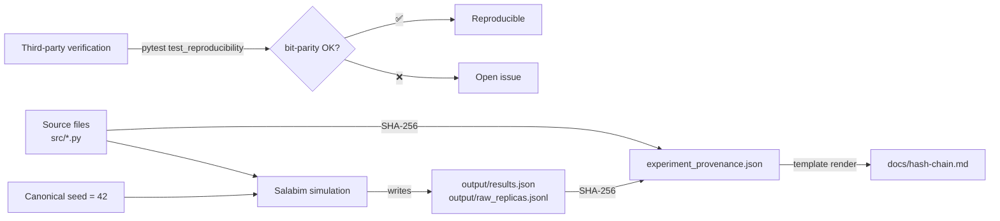

<!--
This file is regenerated by scripts/regen_hash_chain.py from output/experiment_provenance.json.
Manual edits will be overwritten on the next regeneration.
Source-of-truth for hashes: output/experiment_provenance.json (machine-readable).
-->

# Cryptographic Integrity Chain

> [!IMPORTANT]
> Single source of truth for the SHA-256 audit trail of this software artifact.
> Mathematical reproducibility is mechanically verifiable: given the pinned
> dependencies in `requirements.txt` and `seed_canonical = 42`, re-execution
> produces bit-identical outputs.

| Field | Value |
|---|---|
| Version | `0.3.2` |
| Git snapshot | `cce1ca67da36d12ff71c90ce65a6c2c6333bd71d` |
| Canonical regeneration timestamp (UTC) | `2026-05-10T11:24:06.658742+00:00` |
| Author | Carlos Ulisses Flores ([ORCID 0000-0002-6034-7765](https://orcid.org/0000-0002-6034-7765)) |
| License | Apache-2.0 |
| Bit-parity status | ✅ verified — re-execution under `seed_canonical = 42` produces identical hashes |

---

## Purpose

This document is the **human-readable companion** to `output/experiment_provenance.json`. It records the SHA-256 chain that guarantees verifiable reproducibility of the Salabim discrete-event simulation that backs the published results.

Each hash is a **cryptographic proof** that, given identical source files and the canonical seed (`42`) on Python 3.14.4 with the pinned dependency set, execution is bit-deterministic across runs and across hardware. This *deterministic-by-design* property aligns the artifact with the FAIR principles (Wilkinson et al., 2016) and the ACM Artifact Review and Badging v1.1 guidelines.



---

## Canonical seed

```text
seed_canonical = 42
```

Defined in `src/main.py`. Each replica `i` uses an isolated `random.Random(42 + i)` (no global state) to sample parameters from the operational range, and the same value `42 + i` is passed to `salabim.Environment(random_seed=...)` for the inner Monte-Carlo. Every execution under `seed_canonical = 42` produces the same sequence of sampled parameters and the same discrete-event trajectory per replica.

---

## Source file hashes (SHA-256)

| File | SHA-256 |
|---|---|
| `src/__init__.py` | `526fcb02f629baa42dc9e6eb2382de9379aee789cd22c15db3bc1027e776be10` |
| `src/config.py` | `3dba37a31fe43d77bff896aaa1c438328876fcefcb14068ddd23d7053ea56a2e` |
| `src/simulation.py` | `e7ea20341b3314e7175cdab066089c9fbec255d34d7256f76790d62a6129b9b4` |
| `src/main.py` | `4ce9046c6f1de871d1191327122d0da7573bad359d1b34535058d801773e6ed3` |
| `src/report.py` | `6a050ada6b1289d39004bef12d9668d9cefe7370fab8551c3d362c3658fd2dcc` |

---

## Output hashes (SHA-256)

| File | SHA-256 |
|---|---|
| `output/results.json` | `5fd8724c627cfa94c4631428cf085e64a9defa123d1d3cc488f61d81af8b5f2c` |
| `output/raw_replicas.jsonl` | `3a61144775eed7b173b2c8e9e751e8c2088013512085dd0bb2936cfce427cf5e` |
| `output/experiment_provenance.json` | (auto-generated by `scripts/gen_provenance.py`) |
| `output/pareto_proof.json` | (regenerable via `scripts/pareto_proof.py`) |
| `output/saturated_pipeline.json` | (regenerable via `scripts/saturated_pipeline_plot.py`) |

---

## Pinned dependencies (resolved at provenance generation time)

| Package | Version |
|---|---|
| matplotlib | `3.10.9` |
| networkx | `3.6.1` |
| numpy | `2.4.4` |
| pandas | `3.0.2` |
| pytest | `9.0.3` |
| ruff | `?` |
| salabim | `26.0.5` |
| scipy | `1.17.1` |
| seaborn | `0.13.2` |

Full pin set in `requirements.txt`. Reproduction requires Python 3.14.4 — use the included `Dockerfile` to guarantee the runtime.

---

## How to verify the chain (step-by-step)

### Step 1 — Verify source file hashes

```bash
shasum -a 256 src/__init__.py src/config.py src/simulation.py src/main.py src/report.py
```

Each hash must match the table above **exactly**. A 1-character divergence indicates the file was modified.

### Step 2 — Re-execute the canonical simulation

```bash
python -m venv .venv
.venv/bin/pip install -e ".[dev]"
.venv/bin/python -m src.main --replicates 300 --duration 1800 --workers 8
```

### Step 3 — Verify regenerated output hashes

```bash
shasum -a 256 output/results.json output/raw_replicas.jsonl
```

### Step 4 — Cross-validate via pytest

```bash
.venv/bin/python -m pytest tests/ -v
```

Expected: 53 tests pass in ~5.5 s. The test `test_reproducibility` explicitly verifies bit-parity of the p99 metric across two runs with the same seed.

> [!WARNING]
> If any of Steps 1–4 fails, do **not** ship results derived from the run. The chain is broken and must be re-established before downstream artifacts (figures, tables, paper) are considered valid.

---

## Reference Git snapshot

```text
commit cce1ca67da36d12ff71c90ce65a6c2c6333bd71d
```

This commit is the canonical truth point for version 0.3.2. To reproduce the exact snapshot that generated the hashes above:

```bash
git checkout cce1ca67da36d12ff71c90ce65a6c2c6333bd71d
```

Modifications after this commit do not invalidate the chain but produce different hashes. For academic citation, always pin to this commit (or the equivalent tagged release `v0.3.2`).

---

## Reference hardware (informative, not deterministic)

| Attribute | Value |
|---|---|
| Platform | `macOS-26.5-arm64-arm-64bit-Mach-O` |
| Architecture | `arm64` |
| Logical CPUs | `14` |
| Python implementation | `CPython` |

The hash chain is **hardware-independent**: Python 3.14.4 with the pinned dependency set produces identical results on any compatible architecture (x86-64 Linux, arm64 macOS, etc.).

---

## Continuous self-validation

The chain must be regenerated and audited whenever:

1. Any file in `src/` is modified
2. Any canonical parameter in `config.py` changes
3. Any dependency in `requirements.txt` is upgraded
4. Before any tagged release on Zenodo / GitHub
5. Before any academic submission that cites this software

One-liner to regenerate:

```bash
python scripts/gen_provenance.py
python scripts/regen_hash_chain.py
```

---

## References

- ACM. (n.d.). *ACM Artifact Review and Badging v1.1*. <https://www.acm.org/publications/policies/artifact-review-and-badging-current>
- Citation File Format. (n.d.). *CFF specification v1.2*. <https://citation-file-format.github.io/>
- Wilkinson, M. D., Dumontier, M., Aalbersberg, I. J., Appleton, G., Axton, M., Baak, A., et al. (2016). 'The FAIR Guiding Principles for scientific data management and stewardship', *Scientific Data*, vol. 3, no. 1, p. 160018. <https://doi.org/10.1038/sdata.2016.18>
