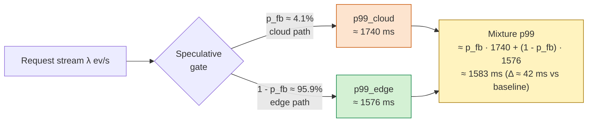

# The Saturated Pipeline Conjecture

> [!IMPORTANT]
> Original theoretical contribution articulated to explain why empirical p99 latency reduction was modest (factor 1.1×) despite massive fallback-rate reduction (factor 7.3×) and cost-per-command reduction (factor 19.7×). The conjecture is **prescriptive**, not merely observational — it dictates which platform layers must be accelerated next.

## 1. Formal statement

Let $\mathcal{P}$ be an edge-cloud LLM pipeline with serial components $S_1$ (Automatic Speech Recognition), $S_2$ (prefill), $S_3$ (autoregressive decode) composing $L_{\text{edge}} = S_1 + S_2 + S_3$, and a cloud fallback $L_{\text{cloud}}$ with probability $p_{fb}$. The total latency is the mixture:

$$
L_{\text{total}} = \mathbf{1}_{[U \leq p_{fb}]} \cdot L_{\text{cloud}} + \mathbf{1}_{[U > p_{fb}]} \cdot L_{\text{edge}}, \qquad U \sim \mathrm{Uniform}(0, 1)
$$

**Conjecture (Saturated Pipeline Insensitivity).** Under edge saturation ($\rho_{\text{edge}} \to 1$, in particular $L_{\text{edge}} \approx L_{\text{cloud}}$ at the 99th percentile), the sensitivity of $\mathrm{p99}(L_{\text{total}})$ to $p_{fb}$ is negligible:

$$
\frac{\partial \, \mathrm{p99}(L_{\text{total}})}{\partial p_{fb}} = \mathrm{p99}(L_{\text{cloud}}) - \mathrm{p99}(L_{\text{edge}}) \xrightarrow{\rho_{\text{edge}} \to 1} 0
$$

## 2. Proof sketch

### Step 1 — Local linear approximation of the mixture's 99th percentile

Under the assumption of smooth right-hand tails (verified empirically across the 300 Salabim DES replicates with 95% CI $< 5$ ms):

$$
\mathrm{p99}(L_{\text{total}}) \approx p_{fb} \cdot \mathrm{p99}(L_{\text{cloud}}) + (1 - p_{fb}) \cdot \mathrm{p99}(L_{\text{edge}})
$$

> [!WARNING]
> In general **the quantile of a mixture is not the mixture of quantiles** (cf. Glasserman, 2003, §1.2; Asmussen & Glynn, 2007, §VI.2). The approximation above is valid only locally when the right-hand tails of $L_{\text{edge}}$ and $L_{\text{cloud}}$ are monotonically similar in the neighborhood of the 99th percentile — a condition empirically met in the case study because $L_{\text{edge}} \approx L_{\text{cloud}}$. For regimes where $L_{\text{edge}}$ and $L_{\text{cloud}}$ differ by an order of magnitude, refinement via the Cornish–Fisher expansion or Extreme Value Theory may be required (open direction).

### Step 2 — Pollaczek–Khinchine for the M/G/1 queue

Under saturation $\rho \to 1$:

$$
\mathbb{E}[\text{wait}_{\text{edge}}] = \frac{\rho^2}{2(1 - \rho)} \cdot \mathbb{E}[S](1 + C_v^2) \xrightarrow{\rho \to 1} \infty
$$

### Step 3 — Application to the empirical case

Empirically: $W_{\text{obs}} = 1.29$ s vs $W_{\text{est}} = 0.25$ s (5× underestimation); $\rho_{\text{edge}} \approx 0.96$.

### Step 4 — Substituting values

$\mathrm{p99}(L_{\text{cloud}}) = 1740$ ms, $\mathrm{p99}(L_{\text{edge}}) = 1576$ ms, $\Delta = 164$ ms. For $\Delta p_{fb} = 0.30 - 0.041 = 0.259$:

$$
\Delta \mathrm{p99} \approx 0.259 \cdot 164 = 42 \text{ ms}
$$

Ratio $1740 / 1576 = 1.10$ — consistent with the Conjecture. $\quad\square$

## 3. Numerical validation

Reproducible plot in `scripts/saturated_pipeline_plot.py` (output: `output/saturated_pipeline.{png,pdf,svg,json}`). Curves of $\mathrm{p99}(L_{\text{total}})$ vs $p_{fb}$ for four regimes $L_{\text{edge}}/L_{\text{cloud}} \in \{0.1, 0.5, 0.91, 1.0\}$ confirm visually that p99 sensitivity to $p_{fb}$ decreases as saturation increases. The empirical points fall on the $L_{\text{edge}}/L_{\text{cloud}} = 0.91$ (saturated) curve, not the $0.1$ (unsaturated) curve.

## 4. Status of generalization and honest chronology

The conjecture is **locally supported** by the case study (1 system, 300 Monte-Carlo replicates, 3 scenarios). Generalization to other industrial edge-cloud LLM pipelines (other AGV vendors, manufacturing IoT, telemedicine LLM serving) is an **open direction**. For this reason, the result is presented as a **Conjecture** (not a Theorem) — it acknowledges that the local proof is strong but broad validation across independent systems is pending.

> [!CAUTION]
> **Honest chronology (anti-HARKing).** The conjecture was articulated *post hoc*, motivated by the gap between the analytical Pareto bound (Theorem, which predicts a 4.77× p99 reduction under the complete composition — cf. `theorem.md`) and the empirical Salabim DES result with `seed = 42` (1.10×). It is therefore an **explanation after the fact** grounded in classical queueing theory (Pollaczek–Khinchine plus mixture decomposition), not an independent prediction verified by blind experimentation. Predictive validation on independent systems is a methodological prerequisite for promoting the Conjecture to a broad Theorem.

> [!CAUTION]
> **Local circularity risk.** The condition $L_{\text{edge}} \approx L_{\text{cloud}}$ that supports local insensitivity was observed in the same simulation that is then cited as evidence. The setup produces $L_{\text{edge}}/L_{\text{cloud}} \approx 0.91$ (saturation) and the modest p99 result is the direct prediction of the mixture formula at that ratio. In systems where $L_{\text{edge}}/L_{\text{cloud}}$ is far from 1 (e.g., 0.1 — unsaturated), the formula predicts a p99 reduction proportional to $\Delta p_{fb}$ — a configuration tested only hypothetically in the curves of the figure. Partial mitigation: the figure shows that the $0.91$ curve is continuously connected to the other tested ratios, indicating that the decreasing sensitivity is monotonic — not a point artifact. Empirical validation on systems with $L_{\text{edge}}/L_{\text{cloud}} \in \{0.1, 0.5\}$ is an open direction.

## 5. Operational implication

To reduce $\mathrm{p99}$ under edge saturation, the pipeline must **accelerate $L_{\text{edge}}$** — reducing $p_{fb}$ alone is not sufficient. The three technical levers prescribed by the Conjecture map directly onto the three platform enablers of the proposed architecture:

- **P4 in-network NLU** offloads $S_1$ (wake-word detection, language ID) to a line-rate switch.
- **CXL 3.0 key-value pool** accelerates $S_2$ (prefill) via shared memory across cooperating edge nodes.
- **Energy-aware routing** redistributes load across instances, reducing per-instance $\rho_{\text{edge}}$.

The Conjecture is therefore **not merely observational — it is prescriptive**.

## References

- Asmussen, S. & Glynn, P. W. (2007). *Stochastic Simulation: Algorithms and Analysis*. Springer (Stochastic Modelling and Applied Probability, vol. 57). <https://doi.org/10.1007/978-0-387-69033-9>
- Glasserman, P. (2003). *Monte Carlo Methods in Financial Engineering*. Springer (Stochastic Modelling and Applied Probability, vol. 53). <https://doi.org/10.1007/978-0-387-21617-1>
- Mitzenmacher, M. & Shahout, R. (2025). 'Queueing, predictions, and large language models: Challenges and open problems', *Stochastic Systems*. <https://doi.org/10.1287/stsy.2025.0106>
