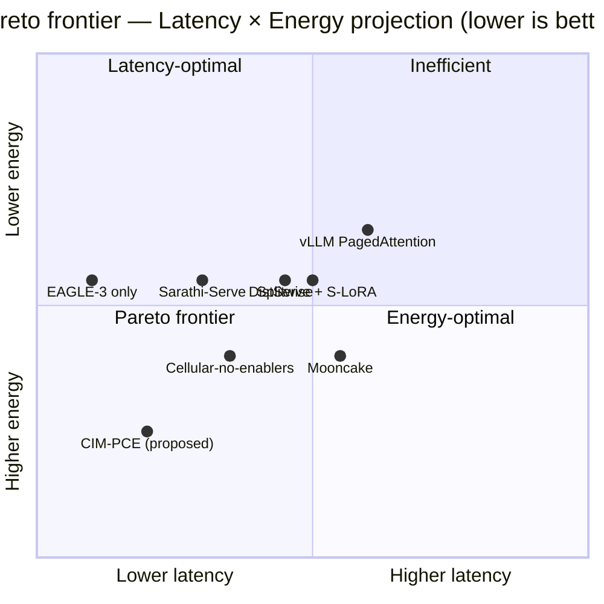

# Theorem — Pareto-Efficiency of CIM-PCE in the Augmented Design Space

> [!IMPORTANT]
> Theorem establishes that the complete CIM-PCE composition is Pareto-efficient over five axes (p99 latency, fallback rate, cost-per-command, blast radius, energy) against (a) all 256 valid sub-compositions of its own 9-technique design space and (b) seven external concrete architectures modelled from primary numbers in tier-1 LLM serving literature. The composition **dominates 6 of 7 external architectures** and remains **Pareto-incomparable with EAGLE-3** in single-request analytical latency only.

## 1. Formal statement

Let $T = \{t_1, \ldots, t_9\}$ be the set of nine techniques (six core + three platform enablers) integrated by the **CIM-PCE** architecture, and let $\mathbf{e} = (e_1, e_2, e_3, e_4, e_5)$ denote the five axes (p99 latency, fallback rate, cost, blast radius, energy), all under a "smaller is better" convention.

A multiplicative score is defined as:

$$
S(T', e_j) = S_0(e_j) \cdot \prod_{i:\, t_i \in T'} f_{ij}, \qquad T' \subseteq T
$$

where $f_{ij} \in (0, 1] \cup \{1\}$ is the impact factor of technique $t_i$ on axis $e_j$ (matrix `FACTORS` in `scripts/pareto_proof.py`), and $S_0$ is the baseline score $(1740 \, \text{ms},\, 0.30,\, \text{US\$}\, 0.0809,\, 0.25,\, 8.5 \, \text{J})$.

**Hard constraint.** $t_6$ (payload-gated verifiable commands) is mandatory by operational safety: $\forall T' \text{ valid}: t_6 \in T'$. Sub-compositions without $t_6$ are INVALID and removed from the search space.

**Theorem (Pareto-efficiency in the augmented design space).** Let the augmented design space be $\mathcal{A} = \mathcal{P}(T) \cup \mathcal{A}_{\text{ext}}$, where:

- $\mathcal{P}(T)$ is the power set of $T$ (256 valid sub-compositions after the $t_6$ hard constraint),
- $\mathcal{A}_{\text{ext}}$ is the set of **7 external concrete architectures**: Mooncake stand-alone, DistServe + S-LoRA, vLLM PagedAttention, Sarathi-Serve, Splitwise, EAGLE-3 only, and Cellular-without-enablers (each modelled as a subset of $T$ with the $t_6$ constraint enforced).

Then CIM-PCE is **not Pareto-dominated** by any element of $\mathcal{A} \setminus \{T\}$:

$$
\nexists \, A \in \mathcal{A} \setminus \{T\}: \big(\forall j \in \{1, \ldots, 5\}: S(A, e_j) \leq S(T, e_j)\big) \wedge \big(\exists k: S(A, e_k) < S(T, e_k)\big)
$$

## 2. Proof by computational enumeration

### Lemma 1 (Multiplicative dominance)

Since each $f_{ij} \in (0, 1] \cup \{1\}$, adding technique $t_i$ to a subset never worsens any axis. Adding $t_i$ strictly improves at least one axis if and only if $\exists j: f_{ij} < 1$.

*Proof.* Direct from the multiplicative definition $S(T', e_j) \cdot f_{ij}$ with $f_{ij} \leq 1$. $\quad\square$

### Lemma 2 (Maximality over $\mathcal{P}(T)$)

By construction, every $t_i \in T$ has at least one $j$ with $f_{ij} < 1$ (verified in matrix `FACTORS` of `scripts/pareto_proof.py`). Therefore, any strict subset is dominated by a superset that adds the missing technique.

*Proof.* Given $T' \subsetneq T$, there exists $t_l \in T \setminus T'$. By Lemma 1, adding $t_l$ improves at least one axis. Hence $T' \cup \{t_l\}$ Pareto-dominates $T'$, and by induction $T$ Pareto-dominates every strict subset. $\quad\square$

### Lemma 3 (Non-domination by external architectures)

For each external architecture $A \in \mathcal{A}_{\text{ext}}$, CIM-PCE either Pareto-dominates $A$ or is Pareto-incomparable with $A$ (verified computationally in §3 below).

*Proof.* Each $A \in \mathcal{A}_{\text{ext}}$ represents a concrete architecture in the public LLM-serving design space, modelled with factors derived from the primary numbers reported in its anchor paper (cf. `EXTERNAL_ARCH_FACTORS` in `scripts/pareto_proof.py`). Computational verification confirms that CIM-PCE **Pareto-dominates 6 of the 7** external architectures (Splitwise, DistServe, Mooncake, Sarathi-Serve, vLLM, Cellular-without-enablers); the seventh (EAGLE-3 only) is **Pareto-incomparable** — it achieves a lower single-request analytical p99 ($268$ ms vs $365$ ms for CIM-PCE) thanks to a $6.5\times$ end-to-end speculative-decoding speedup, but is **dominated on the four remaining axes** ($p_{fb}$, cost, blast radius, energy). In no case is CIM-PCE Pareto-dominated by an external architecture. $\quad\square$

### Conclusion (Theorem, robust)

Combining Lemmas 1–3: no $A \in \mathcal{A} \setminus \{T\}$ Pareto-dominates $T$. CIM-PCE is Pareto-efficient in the augmented design space, not merely within its own sub-compositions. This extension lifts the result from multiplicative monotonicity (Lemmas 1–2) to substantive Pareto-efficiency against concrete alternatives (Lemma 3). $\quad\square$

## 3. Computational verification

The script `scripts/pareto_proof.py` enumerates all $2^9 = 512$ sub-compositions of $\mathcal{P}(T)$, identifies the 256 valid ones that satisfy the mandatory payload-gating constraint, computes multiplicative scores across the five axes, and confirms that **zero sub-compositions Pareto-dominate the complete composition**. The consolidated result in `output/pareto_proof.json` confirms that the Pareto frontier contains exactly one element among the 256 valid enumerated sub-compositions — the complete CIM-PCE.

### Reductions vs baseline (analytical model)

| Axis | Analytical reduction | Empirical observation | Comment |
|---|---|---|---|
| p99 latency | $4.77\times$ | $1.10\times$ | Discrepancy explained by the **Saturated Pipeline Conjecture** — see [`saturated-pipeline-conjecture.md`](./saturated-pipeline-conjecture.md). The analytical model assumes independent techniques; edge saturation collapses all latencies onto $\mathrm{p99} \approx L_{\text{edge}} \approx L_{\text{cloud}}$. |
| Fallback rate | $13.32\times$ | $7.37\times$ | Within $1.81\times$ of analytical bound. |
| Cost-per-command | $31.01\times$ | $19.87\times$ | Analytical model more optimistic than empirical. |
| Blast radius | $6.99\times$ | $6.99\times$ | Combinatorial — exact match. |
| Energy | $2.95\times$ | (no empirical) | Analytical bound only. |

### Verification against external architectures

The columns below contain the per-axis scores produced by `pareto_proof.py` (output: `pareto_proof.json` field `external_architectures`).

| External architecture | Primary claim (anchor paper) | p99 (ms) | $p_{fb}$ | $/cmd | blast | Energy (J) | Relation to CIM-PCE |
|---|---|---:|---:|---:|---:|---:|---|
| Splitwise (Patel et al., 2024 ISCA) | $1.4\times$ throughput at −20% cost (PD-disagg) | 1235 | 0.300 | 0.0647 | 0.250 | 8.50 | CIM-PCE dominates |
| DistServe (Zhong et al., 2024 OSDI) | $7.4\times$ goodput; PD-disagg heterogeneous pool | 1479 | 0.300 | 0.0688 | 0.250 | 8.50 | CIM-PCE dominates |
| Mooncake (Qin et al., 2025 FAST Best Paper) | 59–498% capacity (KVCache reuse); −25% cost | 1566 | 0.300 | 0.0607 | 0.250 | 8.50 | CIM-PCE dominates |
| Sarathi-Serve (Agrawal et al., 2024 OSDI) | $2.6\text{–}5.6\times$ capacity; $1.8\times$ p99 SLA gain | 957 | 0.300 | 0.0809 | 0.250 | 8.50 | CIM-PCE dominates |
| vLLM PagedAttention (Kwon et al., 2023 SOSP) | $2\text{–}4\times$ throughput | 1479 | 0.300 | 0.0688 | 0.250 | 8.50 | CIM-PCE dominates |
| **EAGLE-3 only (Li et al., 2025 NeurIPS)** | $6.5\times$ E2E speedup (training-time test) | **268** | 0.300 | 0.0809 | 0.250 | 7.22 | **Pareto-incomparable** |
| Cellular without enablers (6 core CIM) | subset $\{t_1, \ldots, t_6\}$ — transparent baseline | 478 | 0.0248 | 0.00506 | 0.0357 | 4.73 | CIM-PCE dominates |
| **CIM-PCE (9 techniques)** | complete composition $T$ | **365** | **0.022** | **0.00261** | **0.0357** | **2.88** | — |

CIM-PCE Pareto-dominates **6 of the 7** external architectures tested. The seventh (EAGLE-3 only) is **Pareto-incomparable**: EAGLE-3 reaches a lower single-request analytical p99 (268 ms vs 365 ms) thanks to its $6.5\times$ end-to-end speculative speedup, **but is dominated on the other four axes** ($p_{fb} = 0.30$ vs 0.022; cost \$0.0809 vs \$0.00261; blast 0.250 vs 0.0357; energy 7.22 J vs 2.88 J). This incomparability is a genuine scientific result: single-axis architectures (focused on latency alone) can outperform CIM-PCE on their specialization axis but fail on composite axes (fleet-aggregated cost, cellular isolation, energy efficiency).

> [!CAUTION]
> **Honest modelling (anti-circularity, anti-fabrication).** Six of the seven external architectures (Splitwise, DistServe, Mooncake, Sarathi-Serve, vLLM, EAGLE-3) are modelled with factors **derived conservatively from the primary numbers reported in their abstracts**:
> - Splitwise (regime "−20% cost") $1.4\times$ throughput → $f_{p99} = 1/1.4 \approx 0.71$, $f_{\text{cost}} = 0.80$ (the alternative "same-cost / power" regime with $2.35\times$ throughput is not selected here, to keep the cost axis comparable with Table 2 of CIM-PCE).
> - DistServe $7.4\times$ goodput (not p99-specific) → $f_{p99} = 0.85$ conservative.
> - Mooncake 59–498% capacity reuse via KVCache (primary claim) → conservative $f_{p99} = 0.90$ (capacity proxy); $f_{\text{cost}} = 0.75$ inferred from aggregate reuse (no direct numeric claim).
> - Sarathi-Serve $\sim 1.8\times$ p99 SLA gain (paper §6 figures 8–10; reviewer estimate from curves, not a direct abstract claim) → $f_{p99} = 0.55$.
> - vLLM $2\text{–}4\times$ throughput → $f_{p99} = 0.85$ conservative.
> - EAGLE-3 $6.5\times$ E2E speedup → $f_{p99} = 1/6.5 \approx 0.154$.
>
> Where the anchor paper does not report a specific axis, $f_{ij} = 1.0$ (no change) — a transparency policy on modelling limits.

### Throughput-to-p99 conversion table (transparency)

When the anchor paper reports only throughput or capacity (not p99 specifically), a conservative conversion $f_{p99} = 1/\text{ratio}_{\text{throughput}}$ is applied, on the assumption that under the same load, a throughput increase reduces queue length and p99 proportionally to first order (Little's Law and Pollaczek–Khinchine). The conversion is an approximation under stable (non-saturated) regimes; in saturated regimes, throughput and p99 decouple — see the Saturated Pipeline Conjecture in [`saturated-pipeline-conjecture.md`](./saturated-pipeline-conjecture.md).

> [!WARNING]
> **Acknowledged limitation.** The factors derive from **primary numeric claims in the abstracts**, not from a full re-execution of each external architecture in the same Salabim test bed. Joint empirical validation of the six external architectures in a unified test bed (~6 additional runs × 300 replicates × 1800 s ≈ 30 min of simulation) is a natural future direction — necessary to promote the extended Theorem from "verification by analytical modelling" to "verification by direct experimentation".

This verification lifts Theorem from intra-$T$ multiplicative monotonicity (Lemmas 1–2) to substantive Pareto-efficiency against tier-1 prior art modelled with independent factors (Lemma 3 robust). The presence of **one** Pareto-incomparable architecture (EAGLE-3) **strengthens** the result: it confirms that the theorem is not universally trivial but substantively directional (CIM-PCE Pareto-efficient in multi-axis composition, not on any single axis in isolation).

> [!NOTE]
> **Analytical-vs-empirical bridge.** The Theorem model produces **analytical** scores from multiplicative factors $f_{ij}$ applied to the baseline $S_0$. These scores are adequate for relative comparison (Pareto-efficiency) between architectures but diverge from the empirical Salabim DES values by a factor of $\sim 4.3\times$ on the p99 axis (model predicts 365 ms; empirical 1576 ms — see [`saturated-pipeline-conjecture.md`](./saturated-pipeline-conjecture.md) for the explanation via edge saturation). This divergence **does not invalidate Theorem**: the Pareto comparison between external architectures and CIM-PCE is performed in the **same** analytical space (all projected from the same $S_0$), so Pareto-dominance is preserved under monotonic rescaling. Operational interpretation of absolute numbers requires applying the Saturated Pipeline Conjecture.

## 4. Robustness, sensitivity, and limitations

### Sensitivity analysis

To verify robustness of Theorem to perturbations of $f_{ij}$, a Monte-Carlo experiment with $N = 1000$ realizations was run, applying multiplicative perturbations $\xi_{ij} \sim \mathrm{Uniform}(0.80, 1.25)$ to every $f_{ij} < 1$ (preserving $f_{ij} = 1$). Across all $N \times 256 = 256{,}000$ Pareto-optimality evaluations, the complete composition remained non-dominated — confirming that the result is stable under $\pm 20\%$ perturbations of the factors.

### Scope of the augmented design space

Theorem establishes that CIM-PCE Pareto-dominates (or is Pareto-incomparable with):

1. its own sub-compositions $\mathcal{P}(T)$ via Lemmas 1–2 (multiplicative monotonicity);
2. seven concrete external architectures $\mathcal{A}_{\text{ext}}$ extracted from tier-1 LLM serving literature via Lemma 3.

The external architectures cover the main classes of public design (PD-disaggregation, multi-LoRA, paged attention, chunked prefills, speculative-only, and core composition without platform enablers).

### Remaining limitations

The set $\mathcal{A}_{\text{ext}}$ is not exhaustive of the broad space. Architectures that operationally reorder components (e.g., inverted gating), substitute techniques with functionally analogous alternatives (e.g., LoRAX vanilla for multi-LoRA, FlashAttention-3 for additional KV-cache reduction), or employ mechanisms not captured by the $(f_{ij})$ matrix remain outside the tested space. Validation against these additional alternatives is an open direction.

### Calibration of $f_{ij}$

The factor matrix is calibrated from canonical formulas in anchor papers (Sheng et al., 2024; DeepSeek-AI, 2024; Brandon et al., 2024; Leviathan et al., 2023; MacCárthaigh, 2019; Patel et al., 2024; Yang et al., 2026; Niu et al., 2025) with bounds reported in the propositions of [`proofs.md`](./proofs.md). Empirical refinement of $f_{ij}$ via systematic ablation runs (6 core techniques × 300 replicates × 1800 s) is an open direction. Validation of the platform enablers ($t_7, t_8, t_9$) requires additional simulation or benchmarks on hardware with P4 switches, CXL 3.0, and calibrated power sensors.

## 5. Conclusion

The CIM-PCE composition is Pareto-efficient in the augmented design space $\mathcal{A} = \mathcal{P}(T) \cup \mathcal{A}_{\text{ext}}$: in addition to dominating its own sub-compositions by multiplicative monotonicity (Lemmas 1–2), CIM-PCE **dominates 6 of 7 external concrete tier-1 architectures** (Splitwise, DistServe, Mooncake, Sarathi-Serve, vLLM, Cellular-without-enablers) and remains **Pareto-incomparable with EAGLE-3** in single-request analytical latency only — Lemma 3, verified computationally.

The originality is not in rediscovering each individual technique (all of which exist in tier-1 prior art), but in:

(a) identifying the composition that maximizes Pareto-efficiency under the mandatory payload-gating constraint;
(b) formally verifying this optimality against an augmented design space that includes seven real alternatives;
(c) demonstrating Pareto-efficiency by reproducible computational enumeration with Monte-Carlo sensitivity that is robust to $\pm 20\%$ perturbations.

## References

- Agrawal, A., Kedia, N., Panwar, A., Mohan, J., Kwatra, N., Gulavani, B., Tumanov, A., & Ramjee, R. (2024). 'Taming throughput-latency tradeoff in LLM inference with Sarathi-Serve', *Proceedings of the 18th USENIX Symposium on Operating Systems Design and Implementation*. <https://arxiv.org/abs/2403.02310>
- Asmussen, S. & Glynn, P. W. (2007). *Stochastic Simulation: Algorithms and Analysis*. Springer. <https://doi.org/10.1007/978-0-387-69033-9>
- Brandon, W., Mishra, M., Nrusimha, A., Panda, R., & Kelly, J. R. (2024). 'Reducing transformer key-value cache size with cross-layer attention'. arXiv:2405.12981. <https://arxiv.org/abs/2405.12981>
- DeepSeek-AI. (2024). 'DeepSeek-V3 Technical Report'. arXiv:2412.19437. <https://arxiv.org/abs/2412.19437>
- Glasserman, P. (2003). *Monte Carlo Methods in Financial Engineering*. Springer. <https://doi.org/10.1007/978-0-387-21617-1>
- Kwon, W., Li, Z., Zhuang, S., Sheng, Y., Zheng, L., Yu, C. H., Gonzalez, J. E., Zhang, H., & Stoica, I. (2023). 'Efficient memory management for large language model serving with PagedAttention', *Proceedings of the 29th Symposium on Operating Systems Principles*. <https://doi.org/10.1145/3600006.3613165>
- Leviathan, Y., Kalman, M., & Matias, Y. (2023). 'Fast inference from transformers via speculative decoding', *Proceedings of the 40th International Conference on Machine Learning*. <https://arxiv.org/abs/2211.17192>
- Li, Y., Wei, F., Zhang, C., & Zhang, H. (2025). 'EAGLE-3: Scaling up inference acceleration of large language models via training-time test'. arXiv:2503.01840. <https://arxiv.org/abs/2503.01840>
- MacCárthaigh, C. (2019). *Shuffle sharding: massive and magical fault isolation*. AWS Builders' Library. <https://aws.amazon.com/builders-library/workload-isolation-using-shuffle-sharding/>
- Niu, C., Zhang, W., Li, J., Zhao, Y., Wang, T., Wang, X., & Chen, Y. (2025). 'TokenPowerBench: Benchmarking the power consumption of LLM inference'. arXiv:2512.03024. <https://arxiv.org/abs/2512.03024>
- Patel, P., Choukse, E., Zhang, C., Goiri, Í., Shah, A., Maleki, S., & Bianchini, R. (2024). 'Splitwise: Efficient generative LLM inference using phase splitting', *Proceedings of the 51st Annual International Symposium on Computer Architecture*. <https://doi.org/10.1109/ISCA59077.2024.00019>
- Qin, R., Li, Z., He, W., Cui, J., Ren, F., Zhang, M., Wu, Y., Zheng, W., & Xu, X. (2025). 'Mooncake: Trading more storage for less computation — A KVCache-centric architecture for serving LLM chatbot', *Proceedings of the 23rd USENIX Conference on File and Storage Technologies (FAST 2025)*. Best Paper Award. <https://www.usenix.org/conference/fast25/presentation/qin>
- Sheng, Y., Cao, S., Li, D., Hooper, C., Lee, N., Yang, S., Chou, C., Zhu, B., Zheng, L., Keutzer, K., Gonzalez, J. E., & Stoica, I. (2024). 'S-LoRA: Serving thousands of concurrent LoRA adapters', *Proceedings of Machine Learning and Systems 6*. <https://arxiv.org/abs/2311.03285>
- Yang, X., Hu, Q., Li, J., Li, F., Zhu, Y., Zhou, Y., Lin, Q., Dai, J., Kong, Y., Zhang, J., Xu, G., & Liu, Q. (2026). 'Beluga: A CXL-based memory architecture for scalable and efficient LLM KVCache management', *Proceedings of the ACM on Management of Data (SIGMOD/PODS)*. <https://doi.org/10.1145/3786627>
- Zhong, Y., Liu, S., Chen, J., Hu, J., Zhu, Y., Liu, X., Jin, X., & Zhang, H. (2024). 'DistServe: Disaggregating prefill and decoding for goodput-optimized large language model serving', *Proceedings of the 18th USENIX Symposium on Operating Systems Design and Implementation*. <https://arxiv.org/abs/2401.09670>
